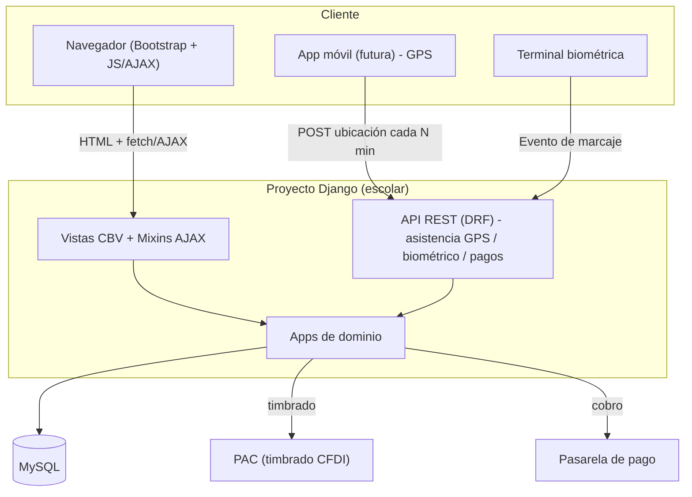

# Sistema de Administración y Seguimiento Escolar — Diseño de Arquitectura

## 1. Alcance confirmado

- **Niveles académicos**: multi-nivel en un mismo sistema — Preparatoria, Licenciatura, Maestría y Doctorado.
- **Multi-plantel**: la institución puede tener varios planteles/campus; todo el modelo de datos referencia un `Plantel`.
- **Base de datos**: MySQL/MariaDB.
- **Colegiaturas**: periodicidad parametrizable (mensual, bimestral, trimestral, cuatrimestral, semestral, anual), por programa y con vigencia por fecha.
- **Pagos**: registro manual por administración **y** pasarela de pago en línea (proveedor a definir).
- **Nómina**: con timbrado fiscal CFDI (PAC a definir).
- **Asistencia**: terminal biométrica para alumnos y docentes (checador). GPS de monitoreo dentro del plantel vía **app móvil futura** que reporta ubicación cada N minutos (parametrizable, mínimo 3 min); el backend web expone la API REST para esa app.
- **Roles**: Padres/Tutores, Alumnos, Docentes, Administrativos, Directivos — cada uno con su portal.
- **Parametría con vigencia**: colegiaturas, calendario escolar, datos de la universidad/plantel, materias y programas se versionan por fecha de vigencia.

### Huecos pendientes (no bloquean el arranque, se resuelven por módulo cuando se implemente)
1. Proveedor de pasarela de pago (Stripe / Conekta / OpenPay / PayPal / Mercado Pago).
2. Proveedor PAC para timbrado CFDI de nómina (Facturama, SW Sapien, Finkok, etc.) y datos fiscales del emisor.
3. Marca/modelo de la terminal biométrica (define el protocolo de integración: SDK propietario, ZKTeco push, Wiegand, etc.).
4. Plataforma de la app móvil GPS (nativa Android/iOS, Flutter o React Native) — solo se define contrato de API por ahora.
5. Reglas exactas de negocio para becas/descuentos, recargos por pago tardío, reinscripción, baja temporal/definitiva.
6. Catálogo de incidencias (tipos, gravedad, flujo de escalamiento a directivos).

---

## 2. Arquitectura general



### Apps Django (dominios)

| App | Responsabilidad |
|---|---|
| `core` | Usuario custom, `Plantel`, roles/permisos, mixins comunes, modelo base `Vigencia`, dashboard router por rol |
| `academico` | Ciclo/Calendario escolar, Niveles, Programas (Prepa/Lic/Maestría/Doctorado), Planes de estudio, Materias, Grupos, Grados |
| `alumnos` | Alumno, Tutores/Padres, Cardex, documentos, expediente |
| `docentes` | Docente, especialidades, asignación de materias/horarios |
| `inscripciones` | Inscripción/reinscripción, kardex de materias cursadas y calificaciones |
| `asistencia` | Registro de asistencia (alumno/docente), dispositivos biométricos, ubicaciones GPS, parámetros de frecuencia |
| `finanzas` | Conceptos de cobro, colegiaturas parametrizadas, cargos, pagos (manual + pasarela), becas/descuentos |
| `nomina` | Puestos, empleados, percepciones/deducciones, recibos, timbrado CFDI |
| `incidencias` | Catálogo de incidencias, registro y seguimiento/escalamiento |
| `trabajos` | Tareas asignadas por docentes, entregas de alumnos, archivos adjuntos |
| `api` | Endpoints DRF consumidos por app móvil y terminal biométrica |
| `portal` | Vistas/dashboards ejecutivos por rol (padres, alumnos, docentes, administrativos, directivos) |

Cada app sigue la estructura estándar de Django (`models.py`, `views.py`, `urls.py`, `admin.py`, `forms.py`, `templates/<app>/`, `static/<app>/`).

---

## 3. Modelo de datos (entidades principales)

### 3.1 `core`
- **Plantel**: nombre, clave, dirección, datos fiscales, logo, activo.
- **Usuario** (extiende `AbstractUser`): rol principal (choices o M2M a `Group`), plantel(es) asociado(s), teléfono, foto.
- **Vigencia** (mixin/abstract model): `vigente_desde`, `vigente_hasta`, `activo` — lo heredan todos los modelos de parametría.
- Grupos Django: `Padres`, `Alumnos`, `Docentes`, `Administrativos`, `Directivos` (+ permisos granulares por modelo).

### 3.2 `academico`
- **CicloEscolar**: clave, fecha inicio/fin, plantel.
- **CalendarioEvento**: ciclo, fecha, tipo (clases, vacaciones, examen, suspensión), vigencia.
- **NivelEducativo**: Preparatoria / Licenciatura / Maestría / Doctorado (catálogo con vigencia).
- **Programa**: nombre, nivel educativo, plantel, duración, modalidad, vigencia.
- **PlanEstudios**: programa, versión, vigencia.
- **Materia**: clave, nombre, créditos, plan de estudios, semestre/cuatrimestre, vigencia.
- **Grupo**: programa, ciclo, materia, docente, cupo, aula, horario.

### 3.3 `alumnos`
- **Alumno**: usuario (OneToOne), matrícula, programa actual, plantel, estatus (activo/baja/egresado), datos personales.
- **Tutor**: usuario (OneToOne, rol Padre), datos de contacto, relación con alumno(s) (M2M `AlumnoTutor`).
- **Cardex**: alumno, materia, ciclo, calificación, estatus (cursando/aprobada/reprobada), créditos.
- **DocumentoAlumno**: alumno, tipo documento, archivo, fecha carga.

### 3.4 `docentes`
- **Docente**: usuario (OneToOne), plantel(es), especialidad, nivel académico, RFC/CURP, activo.
- **AsignacionDocente**: docente, grupo, materia, ciclo, horario.

### 3.5 `inscripciones`
- **Inscripcion**: alumno, programa, ciclo, fecha, estatus.
- **InscripcionMateria**: inscripción, grupo/materia, calificación final.

### 3.6 `asistencia`
- **DispositivoBiometrico**: plantel, marca/modelo, identificador, ubicación física.
- **RegistroAsistencia**: persona (alumno o docente vía `GenericForeignKey` o FKs opcionales), dispositivo, fecha/hora, tipo (entrada/salida), origen (biométrico/manual).
- **ParametroGPS**: plantel, intervalo_minutos (mínimo 3), activo, vigencia.
- **UbicacionGPS**: persona, latitud, longitud, timestamp, dentro_del_plantel (bool calculado).

### 3.7 `finanzas`
- **PeriodicidadColegiatura**: catálogo (mensual, bimestral, trimestral, cuatrimestral, semestral, anual).
- **ConceptoCobro**: nombre (inscripción, colegiatura, examen, etc.), programa, periodicidad, monto, vigencia.
- **CargoAlumno**: alumno, concepto, periodo, monto, fecha límite, estatus (pendiente/pagado/vencido).
- **Pago**: cargo, monto, fecha, forma de pago (efectivo/transferencia/tarjeta), origen (manual/pasarela), referencia de transacción, usuario que capturó.
- **Beca**: alumno, porcentaje/monto, vigencia, motivo.

### 3.8 `nomina`
- **Puesto**: nombre, plantel, sueldo base.
- **Empleado**: usuario (docente o administrativo), puesto, RFC, NSS, fecha ingreso.
- **PeriodoNomina**: fecha inicio/fin, tipo (quincenal/mensual).
- **ReciboNomina**: empleado, periodo, percepciones, deducciones, neto, estatus timbrado, UUID CFDI, XML/PDF.

### 3.9 `incidencias`
- **TipoIncidencia**: catálogo, gravedad, vigencia.
- **Incidencia**: persona involucrada, tipo, descripción, fecha, registrado_por, estatus, adjuntos.
- **SeguimientoIncidencia**: incidencia, comentario, usuario, fecha (bitácora/escalamiento).

### 3.10 `trabajos`
- **Tarea**: grupo/materia, docente, título, instrucciones, fecha entrega.
- **EntregaTrabajo**: tarea, alumno, archivo(s), fecha entrega, calificación, comentarios.

---

## 4. Roles y control de acceso

- Se usan **`django.contrib.auth.Group`** (Padres, Alumnos, Docentes, Administrativos, Directivos) + permisos por modelo, más un campo `rol_principal` en `Usuario` para enrutar el dashboard.
- **Mixins de autorización** reutilizables: `RoleRequiredMixin(roles=[...])` sobre `LoginRequiredMixin` para proteger cada CBV.
- Un **dashboard router** (`portal/views.py`) redirige tras login según rol a:
  - `/portal/padres/` — estado de cuenta de sus hijos, calificaciones, asistencia, avisos.
  - `/portal/alumnos/` — horario, cardex, tareas, colegiaturas, asistencia propia.
  - `/portal/docentes/` — grupos asignados, pase de lista, captura de calificaciones, tareas.
  - `/portal/administrativos/` — inscripciones, cobranza, incidencias, reportes.
  - `/portal/directivos/` — indicadores ejecutivos (KPIs), aprobar excepciones, reportes globales.
- Row-level: cada consulta filtra además por `plantel` del usuario (para multi-plantel) y por relación (un padre solo ve a sus hijos vía `AlumnoTutor`).

---

## 5. Patrón de presentación: plantilla maestra + AJAX

### 5.1 Jerarquía de templates

```
templates/
  base.html                <- layout maestro (navbar, sidebar por rol, bloques, CSS/JS Bootstrap)
  partials/
    _navbar.html
    _sidebar.html
    _mensajes.html
  <app>/
    <vista>.html           <- extiende base.html (carga completa)
    <vista>_partial.html   <- SOLO el fragmento (usado por AJAX y por la vista completa vía )
```

Regla de oro: **la vista completa incluye el partial**, así no se duplica HTML/lógica:

```django
{# alumnos/lista.html #}


  <div id="contenedor-lista">
    
  </div>

```

### 5.2 Mixin para responder parcial o completo (backend)

Una vista CBV detecta si la petición es AJAX (header `X-Requested-With: XMLHttpRequest` o `HX-Request`) y decide qué template usar, sin duplicar la lógica de `get_context_data`:

```python
class AjaxTemplateMixin:
    """Si la request es AJAX, usa template_name_ajax (solo el fragmento)."""
    template_name_ajax = None

    def get_template_names(self):
        if self.request.headers.get("X-Requested-With") == "XMLHttpRequest" and self.template_name_ajax:
            return [self.template_name_ajax]
        return super().get_template_names()
```

Toda vista de listado/detalle hereda de `AjaxTemplateMixin` + `ListView`/`DetailView`/`FormView`, define `template_name` (completa) y `template_name_ajax` (partial).

### 5.3 Convención JavaScript (fetch + reemplazo de contenedor)

Un solo helper JS reutilizable (`static/js/ajax.js`) intercepta:
- Links con `data-ajax-link` → GET, reemplaza el contenedor indicado y hace `history.pushState` (navegación sin recarga).
- Forms con `data-ajax-form` → POST/GET, reemplaza contenedor y muestra mensajes/errores inline.
- Refresco periódico opcional (`data-ajax-poll="30000"`) para paneles tipo "indicadores en vivo" (asistencia del día, ubicaciones GPS).

Cuándo **sí recargar página completa**: cambios de rol/menú (login/logout), navegación entre módulos raíz (para no acumular estado JS inconsistente), y siempre que el usuario navegue con la URL directa (deep-linking), gracias a que la misma vista sirve completa o parcial según el header.

### 5.4 Bootstrap
- Bootstrap 5 vía CDN en desarrollo (o `django-bootstrap5`/`whitenoise` para producción offline).
- Layout responsive: navbar superior + sidebar colapsable por rol + contenedor de contenido con `id="app-content"` como destino estándar de todos los reemplazos AJAX.

---

## 6. Seguridad (OWASP)
- CSRF: tokens en todos los forms y en cabeceras `fetch` (helper JS añade `X-CSRFToken` automáticamente).
- Autorización server-side siempre (el mixin de rol y el filtrado por plantel/tutoría se aplican en el backend, nunca solo se ocultan botones en el frontend).
- Contraseñas: validadores de Django + políticas de complejidad; considerar 2FA para Directivos/Administrativos.
- Subida de archivos (trabajos, documentos de alumnos): validar tipo/tamaño, almacenar fuera de `MEDIA` públicamente listable si aplica, servir con control de acceso.
- Datos sensibles (nómina, RFC/CURP, ubicación GPS): cifrado en tránsito (HTTPS obligatorio), acceso restringido por rol, auditoría de acceso a nómina.
- Rate limiting en endpoints de la API (ubicación GPS, biométrico) para evitar abuso.
- Secrets (SECRET_KEY, credenciales BD/PAC/pasarela) fuera del repo, vía variables de entorno (`django-environ`).

---

## 7. Plan de construcción por fases

1. **Fase 0 — Base del proyecto** *(este scaffold)*: settings con MySQL, apps creadas, `Usuario` custom, template maestro + patrón AJAX, autenticación y router de dashboard por rol.
2. **Fase 1 — Catálogos y parametría**: `core.Plantel`, `academico` completo (niveles, programas, planes, materias, calendario/ciclo), admin de Django habilitado.
3. **Fase 2 — Alumnos y Docentes**: altas, cardex, expediente, inscripciones/reinscripción.
4. **Fase 3 — Finanzas**: conceptos de cobro parametrizados, cargos, pagos manuales; luego integración de pasarela.
5. **Fase 4 — Asistencia**: registro manual/API biométrico, luego API GPS para app móvil.
6. **Fase 5 — Nómina**: cálculo y recibos; timbrado CFDI al final (depende de PAC elegido).
7. **Fase 6 — Incidencias y Trabajos**.
8. **Fase 7 — Portales ejecutivos y reportes/KPIs** para cada rol.

---

## 8. Stack técnico propuesto

- Django 6.0 (LTS a evaluar), Python 3.12.
- MySQL 8 (`mysqlclient` o `PyMySQL` como driver).
- Django REST Framework (API GPS/biométrico/futura app).
- Bootstrap 5 + JS vanilla (fetch) — sin framework SPA pesado, conforme a "actualizar solo la información quesea necesaria".
- `django-environ` para variables de entorno / settings por ambiente (dev/staging/prod).
- `django-crispy-forms` + `crispy-bootstrap5` (formularios consistentes).
- `celery` + `redis` (fase posterior) para tareas asíncronas: envío de notificaciones, timbrado CFDI, procesamiento de ubicaciones GPS masivas.
